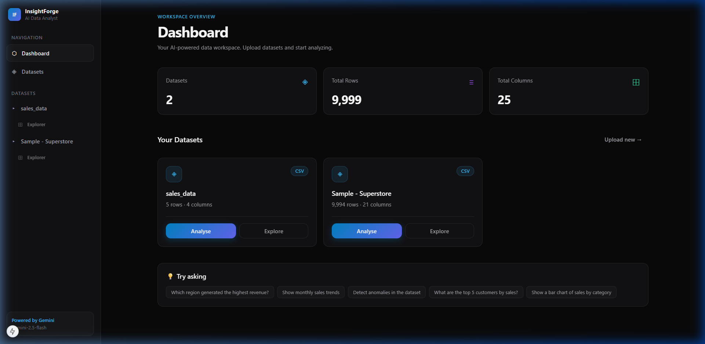
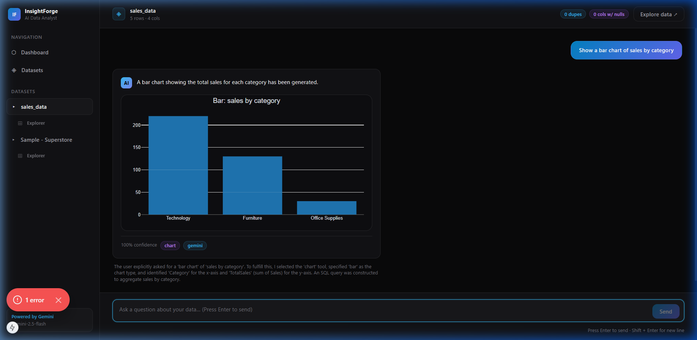
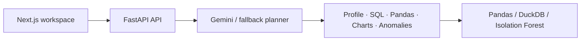

# InsightForge — AI Data Analyst

Upload CSV data, inspect its quality, explore rows, ask questions, generate safe SQL/Pandas analysis, create charts, and find numeric anomalies.

## Screenshots

### Main Dashboard


### Natural Language QA & Interactive Analysis


## Architecture



The API routes are thin; ingestion, validation, memory, planner behavior, analytics, and execution are isolated services.

## Gemini and multi-file analysis

Copy `backend/.env.example` to `backend/.env` and set `GEMINI_API_KEY` to enable Gemini 2.5 Flash. The planner receives table schemas, small samples, and the last 12 session messages, then selects a constrained local tool. It falls back to a deterministic planner if the key is absent or the request fails.

Every upload is registered as `dataset_<dataset-id>` in a shared in-memory DuckDB connection, so SQL generated by Gemini—or sent directly to `/api/generate-sql`—can join multiple uploaded CSVs.

## Local setup

```bash
cd backend
python -m venv .venv
.venv/Scripts/pip install -r requirements.txt
.venv/Scripts/uvicorn app.main:app --reload

cd ../frontend
npm install
npm run dev
```

Open `http://localhost:3000`; API documentation is at `http://localhost:8000/docs`.

## Safety and assumptions

- CSVs are validated for file type, empty input, malformed parsing, and duplicate headers.
- DuckDB accepts only one read-only `SELECT` statement.
- Pandas is AST-parsed, expression-only, and blocks imports, files, network calls, dunder attributes, and arbitrary execution.
- The LLM proposes plans but never receives direct execution rights.
- Datasets and session memory are in process memory and are cleared on API restart.

## Demo video

Add your 10–30 second walkthrough link here before submission: [Demo Video Link](https://example.com/your-demo-video). Show CSV upload, profile, multi-file join, chart, and anomaly detection.

## Docker and tests

Run tests with `pytest`:

```bash
cd backend
pytest
```

Run full stack with Docker Compose:

```bash
docker compose up --build
```
