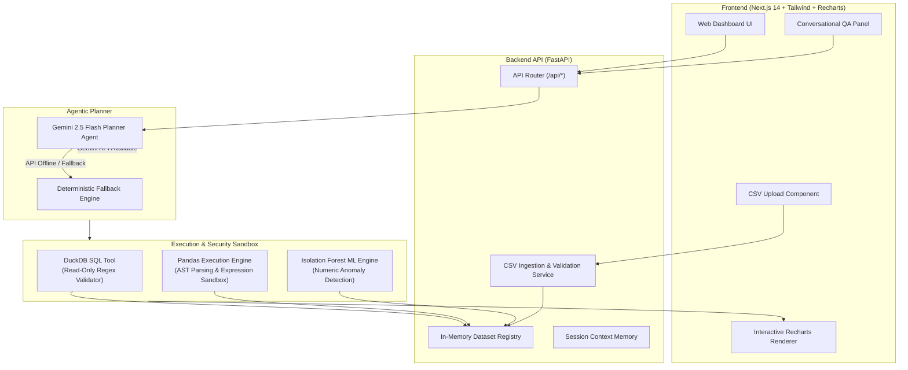

# ⚡ InsightForge — AI Data Analyst

> An end-to-end, production-grade AI Data Analyst platform that enables users to upload CSV datasets, perform conversational natural language querying, execute sandboxed multi-table DuckDB SQL & AST-parsed Pandas code, visualize interactive charts, and run unsupervised machine learning anomaly detection.

[](https://ai-data-analyst-fawn.vercel.app/)
[](https://www.loom.com/share/7bbcd8b9edd14c7ebe74c00b14aa0e15)
[](https://fastapi.tiangolo.com/)
[](https://nextjs.org/)
[](LICENSE)

---

## 📌 Links & Live Resources

- **🌐 Live Production Deployment**: [https://ai-data-analyst-fawn.vercel.app/](https://ai-data-analyst-fawn.vercel.app/)
- **🎥 Video Walkthrough (Loom)**: [Watch 10-30s Demo Video](https://www.loom.com/share/7bbcd8b9edd14c7ebe74c00b14aa0e15)

---

## 📸 Interface Preview & Screenshots

### 1. Main Dashboard & Data Explorer
Upload CSVs, inspect row previews, review data quality summary, and explore column schemas.


### 2. Natural Language QA & Interactive Analysis
Ask complex business questions, auto-generate SQL/Pandas code, view dynamic Recharts visualizations, and inspect Isolation Forest anomalies with step-by-step reasoning.


---

## ✨ Key Features

### 🟢 Core Features
- **📁 Multi-File CSV Ingestion & Validation**: Drag-and-drop multiple CSV files simultaneously. Includes automated validation for empty files, malformed syntax, corrupt rows, and duplicate headers.
- **💬 Conversational Data QA**: Ask natural language business questions (e.g. *"Which region generated highest revenue?"*, *"Show monthly sales trends"*). Session-based memory preserves context across multiple turns.
- **🛢️ Multi-Table DuckDB SQL Engine**: Uploaded CSVs are automatically registered as `dataset_<id>` in an in-memory DuckDB instance. Allows executing complex cross-table `JOIN` queries.
- **🐼 Sandboxed Pandas Code Execution**: Auto-generates and executes Pandas data transformations securely via Python `ast` syntax tree parsing.
- **📊 Dynamic Data Visualizations**: Automatic chart generation including **Bar**, **Line**, **Pie**, **Scatter**, and **Histogram** charts rendered interactively using Recharts.
- **🤖 Unsupervised Anomaly Detection**: Uses `sklearn.ensemble.IsolationForest` to calculate anomaly scores across numerical features and highlight potential outliers with clear explanations.
- **🧠 Chain-of-Thought Reasoning**: Answers include confidence scores, assumptions, limitations, and transparent explanations of execution logic.

### 🌟 Bonus & Advanced Capabilities
- **🔒 Dual AST & SQL Security Sandbox**: Strict AST parsing for Pandas (blocking imports, file I/O, `exec`/`eval`, dunder methods) and regex statement validation for DuckDB SQL (enforcing read-only `SELECT` queries).
- **⚡ Dual-Engine Planner (Gemini + Deterministic Fallback)**: Powered by Google Gemini 2.5 Flash (`google-genai` SDK) with automatic failover to a zero-latency rule-based deterministic planner if no API key is set.
- **📈 Data Profiling & Quality Metrics**: Generates dataset health profiles including missing percentage, data types, distinct counts, and numerical stats (mean, std, min, quantiles).
- **📂 Pre-loaded Sample Datasets**: Comes bundled with ready-to-test datasets (`Sample Superstore.csv`, `retail_sales_dataset.csv`, `sales_data_sample.csv`).

---

## 🏗️ System Architecture



---

## 🛡️ Safety & AST Security Model

Executing code generated by Large Language Models presents inherent security risks. InsightForge enforces a strict multi-layered sandbox:

| Security Layer | Enforced Policy | Implementation Mechanism |
| :--- | :--- | :--- |
| **SQL Engine** | Single read-only `SELECT` statements strictly enforced. | Rejects statement chaining, semicolons, and mutating keywords (`INSERT`, `UPDATE`, `DELETE`, `DROP`, `ALTER`, `TRUNCATE`, `PRAGMA`). |
| **Pandas Sandbox** | AST Expression Parsing with restricted global context. | Parses code into a syntax tree using `ast.parse`. Strips assignment statements, revokes `__builtins__`, blocks `import`, `open`, `os`, `sys`, `exec`, `eval`, `subprocess`, and dunder attributes. |
| **LLM Execution Scope** | No direct execution permissions. | Gemini returns structured JSON tool intents. Code execution is passed down to validated internal tools only. |
| **Data Isolation** | Session-level in-memory storage. | Datasets and conversation state reside purely in process memory; cleared automatically on server restart. |

---

## 🛠️ Tech Stack & Tooling

| Domain | Technology / Library | Purpose |
| :--- | :--- | :--- |
| **Frontend Framework** | Next.js 14 (App Router) & TypeScript | Modern, performant UI with React Server Components |
| **Styling & UI** | Tailwind CSS & Lucide Icons | Responsive, sleek, dark-mode-ready design system |
| **Data Visualization** | Recharts | Responsive SVG charts (Bar, Line, Pie, Scatter) |
| **Backend API** | FastAPI & Uvicorn | High-performance asynchronous Python REST web server |
| **AI / LLM Orchestration**| Google Gemini 2.5 Flash (`google-genai`) | Low-latency agentic planning, natural language comprehension |
| **SQL Engine** | DuckDB | In-process analytical database for multi-CSV JOINs |
| **Data Science & ML** | Pandas, NumPy, Scikit-Learn | Data manipulation & Isolation Forest anomaly detection |
| **Testing & CI** | Pytest | Automated test coverage for tools, analytics & routes |
| **Containerization** | Docker & Docker Compose | Containerized full-stack deployment |

---

## 📁 Repository Directory Structure

```
AI Data Analyst/
├── README.md                                 # Documentation & Project Guide
├── AI Engineer Intern Assignment.docx (1).pdf # Project Requirements Specification
├── docker-compose.yml                        # Docker Compose configuration
├── datasets/                                 # Sample CSV Datasets
│   ├── Sample Superstore.csv
│   ├── retail_sales_dataset.csv
│   └── sales_data_sample.csv
├── docs/
│   └── screenshots/                          # Dashboard & QA Screenshots
│       ├── dashboard.png
│       └── analysis.png
├── backend/                                  # FastAPI Application
│   ├── Dockerfile
│   ├── requirements.txt
│   ├── conftest.py
│   ├── app/
│   │   ├── main.py                           # FastAPI entrypoint & CORS config
│   │   ├── config.py                         # Environment variables configuration
│   │   ├── api/                              # REST API Route controllers
│   │   ├── agents/                           # Gemini & Deterministic Planner Agents
│   │   ├── analytics/                        # Profiler & Isolation Forest Anomaly Detection
│   │   ├── charts/                           # Chart factory & Plotly/Recharts spec builder
│   │   ├── database/                         # DuckDB dataset registry
│   │   ├── memory/                           # Session conversation memory store
│   │   ├── schemas/                          # Pydantic data contracts & DTOs
│   │   ├── services/                         # CSV Ingestion & validation pipeline
│   │   └── tools/                            # AST-sandboxed Pandas & SQL execution tools
│   └── tests/                                # Automated Pytest test suite
└── frontend/                                 # Next.js Application
    ├── Dockerfile
    ├── package.json
    ├── tailwind.config.ts
    ├── app/                                  # Next.js App Router pages (analyse, explore, datasets)
    ├── components/                           # UI Components (Sidebar, UploadPanel, DataTable, Chart)
    ├── services/                             # Frontend API Client services
    └── store/                                # Global state management
```

---

## 🚀 Local Setup & Quickstart

### Prerequisites
- **Python**: `3.10` or higher
- **Node.js**: `18.x` or higher
- **npm** or **yarn**
- *(Optional)* **Docker Desktop**

### 1. Backend Setup

1. Navigate to the backend directory:
   ```bash
   cd backend
   ```
2. Create and activate a Python virtual environment:
   ```bash
   # Windows (PowerShell)
   python -m venv .venv
   .\.venv\Scripts\Activate.ps1

   # macOS / Linux
   python3 -m venv .venv
   source .venv/bin/activate
   ```
3. Install dependencies:
   ```bash
   pip install -r requirements.txt
   ```
4. Create environment file:
   ```bash
   cp .env.example .env
   ```
   *Optionally set your `GEMINI_API_KEY` in `.env` to enable Gemini 2.5 Flash capabilities. If left blank, the app will run seamlessly using the built-in deterministic planner agent.*

5. Start the FastAPI development server:
   ```bash
   uvicorn app.main:app --reload --port 8000
   ```
   - API Endpoint: `http://localhost:8000`
   - Interactive Swagger API Documentation: `http://localhost:8000/docs`

---

### 2. Frontend Setup

1. In a new terminal window, navigate to the frontend directory:
   ```bash
   cd frontend
   ```
2. Install dependencies:
   ```bash
   npm install
   ```
3. Create environment file:
   ```bash
   cp .env.example .env
   ```
4. Start the Next.js development server:
   ```bash
   npm run dev
   ```
5. Open your browser and navigate to `http://localhost:3000`.

---

## 🐳 Docker Deployment

To launch the complete application stack (Backend + Frontend) in containerized environment:

```bash
# Build and run containerized services
docker compose up --build
```

Access services at:
- **Frontend App**: `http://localhost:3000`
- **Backend API**: `http://localhost:8000`
- **Swagger Docs**: `http://localhost:8000/docs`

---

## 🧪 Running Tests

The backend includes comprehensive test coverage using `pytest` for unit testing tool execution, AST sandboxing, CSV ingestion, and route controllers.

```bash
cd backend
pytest -v
```

---

## 📡 API Endpoint Reference

| Endpoint | Method | Request Body / Query | Description |
| :--- | :--- | :--- | :--- |
| `/health` | `GET` | None | Service health check |
| `/api/upload` | `POST` | `multipart/form-data` (files) | Upload and validate single/multiple CSV files |
| `/api/datasets` | `GET` | None | List all currently registered datasets |
| `/api/datasets/{id}` | `DELETE` | Path parameter | Remove a specific dataset from memory |
| `/api/datasets/{id}/profile` | `GET` | Path parameter | Return statistical profile and column metadata |
| `/api/datasets/{id}/rows` | `GET` | `offset`, `limit`, `search` | Paginated row preview with substring filtering |
| `/api/chat` | `POST` | `ChatRequest` (session_id, dataset_id, message) | Natural language QA handled by Gemini Agent |
| `/api/generate-sql` | `POST` | `SqlRequest` (dataset_id, query) | Direct read-only SQL query execution via DuckDB |
| `/api/generate-pandas` | `POST` | `PandasRequest` (dataset_id, code) | Direct sandboxed Pandas AST expression execution |
| `/api/generate-chart` | `POST` | `ChartRequest` (dataset_id, chart_type, x, y) | Generate chart specification |
| `/api/detect-anomalies` | `POST` | `dataset_id` (Query string) | Trigger Isolation Forest ML anomaly detection |

---

## ✅ Assignment Requirement Compliance Matrix

| Requirement (PDF Specification) | Implementation Status | Implementation Details in Codebase |
| :--- | :---: | :--- |
| **CSV Upload & Validation** | ✅ Complete | `CsvIngestionService` ([ingestion.py](file:///c:/Users/manan/OneDrive/Documents/AI%20Data%20Analyst/backend/app/services/ingestion.py)) checks encoding, empty files, malformed rows, duplicate headers. |
| **Natural Language QA** | ✅ Complete | `GeminiPlannerAgent` ([planner.py](file:///c:/Users/manan/OneDrive/Documents/AI%20Data%20Analyst/backend/app/agents/planner.py)) parses NL prompts into structured tool calls. |
| **Insights & Summaries** | ✅ Complete | Business summaries, key metrics, and profile metadata generated via `ProfileService` ([profiler.py](file:///c:/Users/manan/OneDrive/Documents/AI%20Data%20Analyst/backend/app/analytics/profiler.py)). |
| **Interactive Charting** | ✅ Complete | `ChartFactory` ([factory.py](file:///c:/Users/manan/OneDrive/Documents/AI%20Data%20Analyst/backend/app/charts/factory.py)) & Recharts components ([Chart.tsx](file:///c:/Users/manan/OneDrive/Documents/AI%20Data%20Analyst/frontend/components/Chart.tsx)). |
| **SQL & Pandas Generation** | ✅ Complete | Sandboxed tools `SqlTool` ([sql_tool.py](file:///c:/Users/manan/OneDrive/Documents/AI%20Data%20Analyst/backend/app/tools/sql_tool.py)) & `PandasTool` ([pandas_tool.py](file:///c:/Users/manan/OneDrive/Documents/AI%20Data%20Analyst/backend/app/tools/pandas_tool.py)). |
| **Anomaly Detection** | ✅ Complete | `AnomalyService` ([anomalies.py](file:///c:/Users/manan/OneDrive/Documents/AI%20Data%20Analyst/backend/app/analytics/anomalies.py)) uses `IsolationForest` ML with explanations. |
| **Reasoning & Explanations** | ✅ Complete | Chain-of-thought responses return confidence, reasoning, assumptions, and limitations. |
| **Session Memory Context** | ✅ Complete | `SessionMemory` ([session.py](file:///c:/Users/manan/OneDrive/Documents/AI%20Data%20Analyst/backend/app/memory/session.py)) tracks chat history per session ID. |
| **Bonus: Multi-File Analysis** | ✅ Complete | DuckDB multi-table connection enables `JOIN` queries across multiple CSV tables. |
| **Bonus: Docker Support** | ✅ Complete | [docker-compose.yml](file:///c:/Users/manan/OneDrive/Documents/AI%20Data%20Analyst/docker-compose.yml) containerizes both frontend & backend. |
| **Bonus: Sample Datasets** | ✅ Complete | Included under [datasets/](file:///c:/Users/manan/OneDrive/Documents/AI%20Data%20Analyst/datasets/). |

---

## 🤝 Contact & Credits

- **Developer**: Manan
- **Live App**: [https://ai-data-analyst-fawn.vercel.app/](https://ai-data-analyst-fawn.vercel.app/)
- **Loom Walkthrough**: [https://www.loom.com/share/7bbcd8b9edd14c7ebe74c00b14aa0e15](https://www.loom.com/share/7bbcd8b9edd14c7ebe74c00b14aa0e15)
