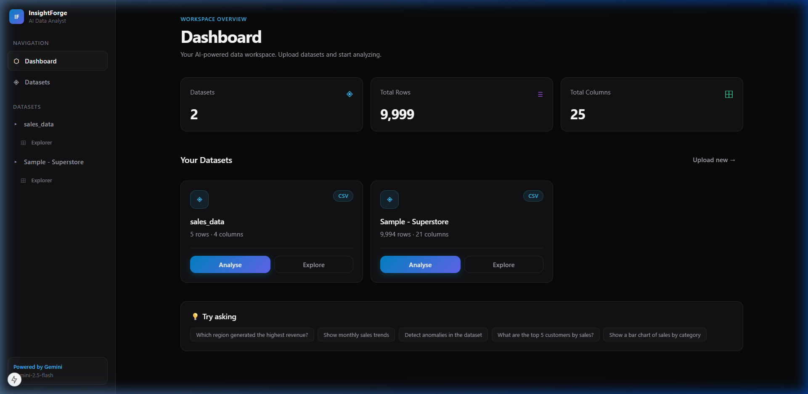
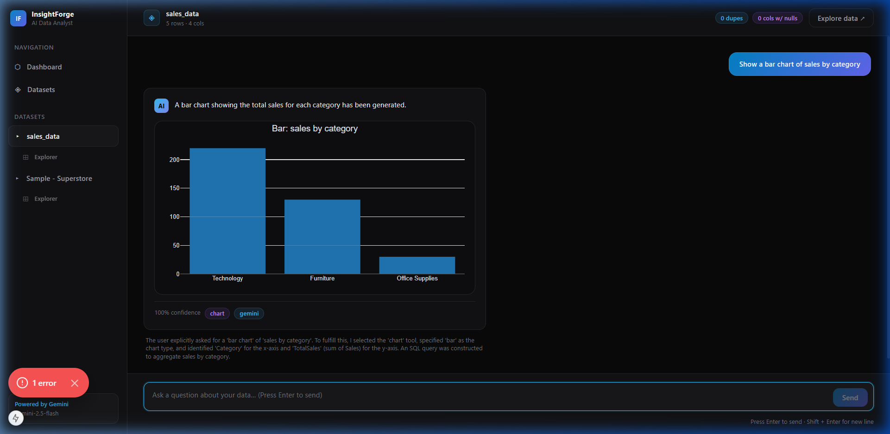
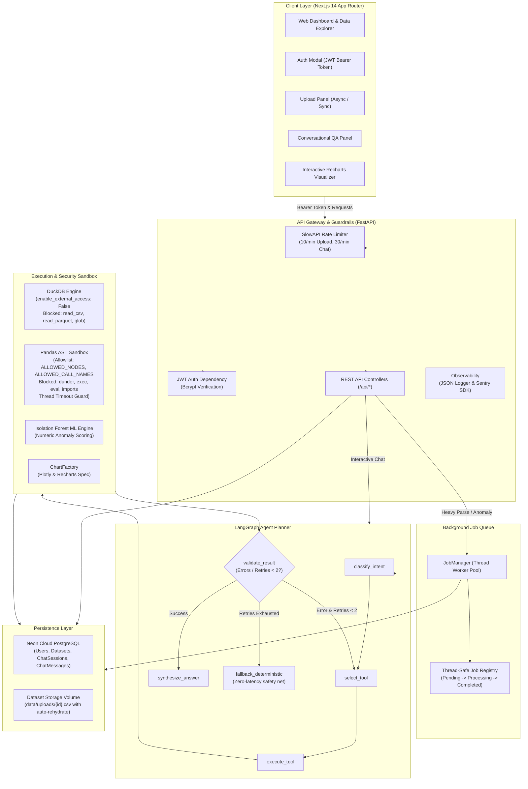

# ⚡ InsightForge — Production AI Data Analyst

> An end-to-end, production-grade AI Data Analyst platform that enables users to upload CSV datasets, perform conversational natural language querying with self-correcting LangGraph multi-agent planning, execute sandboxed multi-table DuckDB SQL & AST-allowlisted Pandas code, visualize interactive charts, run unsupervised machine learning anomaly detection, and persist data across serverless PostgreSQL.

[](https://ai-data-analyst-fawn.vercel.app/)
[](https://www.loom.com/share/7bbcd8b9edd14c7ebe74c00b14aa0e15)
[](https://fastapi.tiangolo.com/)
[](https://nextjs.org/)
[](https://neon.tech/)
[](.github/workflows/ci.yml)
[](LICENSE)

---

## 📌 Links & Live Resources

- **🌐 Live Production Deployment**: [https://ai-data-analyst-fawn.vercel.app/](https://ai-data-analyst-fawn.vercel.app/)
- **🎥 Video Walkthrough (Loom)**: [Watch 10-30s Demo Video](https://www.loom.com/share/7bbcd8b9edd14c7ebe74c00b14aa0e15)

---

## 📸 Interface Preview & Screenshots

### 1. Main Dashboard & Data Explorer
Upload CSVs, inspect row previews, review data quality summary, and explore column schemas.



### 2. Natural Language QA & Interactive Analysis
Ask complex business questions, auto-generate SQL/Pandas code, view dynamic Recharts visualizations, and inspect Isolation Forest anomalies with step-by-step reasoning.



---

## ✨ Key Features

### 🟢 Core Platform Capabilities
- **📁 Multi-File CSV Ingestion & Validation**: Drag-and-drop multiple CSV files simultaneously. Includes automated validation for empty files, malformed syntax, corrupt rows, duplicate headers, 25MB file size limits, and 500k row limits.
- **💬 Conversational Data QA with LangGraph**: Ask natural language business questions (e.g. *"Which region generated highest revenue?"*, *"Show monthly sales trends"*). Session-based persistent memory preserves context across reboots.
- **🛢️ Multi-Table DuckDB SQL Engine**: Uploaded CSVs are automatically registered as `dataset_<id>` in an in-memory DuckDB analytical engine. Hardened with `enable_external_access: False` and table function blocking.
- **🐼 AST-Allowlisted Pandas Execution**: Auto-generates and executes Pandas data transformations securely via strict Python `ast.walk` syntax tree validation.
- **📊 Dynamic Data Visualizations**: Automatic chart generation including **Bar**, **Line**, **Pie**, **Scatter**, and **Histogram** charts rendered interactively using Recharts.
- **🤖 Unsupervised Anomaly Detection**: Uses `sklearn.ensemble.IsolationForest` to calculate anomaly scores across numerical features and highlight potential outliers with clear explanations.
- **🧠 Self-Correcting Agentic Reasoning**: Powered by a 5-node LangGraph state graph featuring a 2-retry validation loop with error feedback and deterministic fallback safety nets.

### 🌟 Enterprise & Production Enhancements
- **🔒 Multi-Tenant Auth & Scoping**: Secure registration and login with bcrypt password hashing and signed JWT bearer tokens. Every dataset, session, and background job is strictly isolated by owner ID.
- **🐘 Neon Cloud PostgreSQL Persistence**: Fully persistent relational models (`users`, `datasets`, `chat_sessions`, `chat_messages`) with automatic DataFrame disk rehydration across server restarts.
- **⚙️ Background Job Queue**: Heavy CSV parsing and Isolation Forest model training are offloaded to an asynchronous background worker pool with polling endpoints (`GET /api/jobs/{id}`).
- **🛡️ Defensive Operational Guardrails**: File size caps (25MB, HTTP 413), row count caps (500k, HTTP 400), and `slowapi` rate limiting on upload and chat endpoints with structured 429 responses.
- **📊 Structured JSON Observability**: Production-ready structured JSON logging via `python-json-logger` and optional Sentry SDK error tracking.
- **🤖 Automated CI Pipeline**: GitHub Actions testing backend pytest suite across Python 3.12 and verifying Next.js production builds.

---

## 🏗️ System Architecture


```mermaid
flowchart TD
  subgraph Client ["Client Layer (Next.js 14 App Router)"]
    UI["Web Dashboard & Data Explorer"]
    AuthModal["Auth Modal (JWT Bearer Token)"]
    UploadUI["Upload Panel (Async / Sync)"]
    ChatUI["Conversational QA Panel"]
    ChartUI["Interactive Recharts Visualizer"]
  end

  subgraph Gateway ["API Gateway & Guardrails (FastAPI)"]
    Limiter["SlowAPI Rate Limiter\n(10/min Upload, 30/min Chat)"]
    Auth["JWT Auth Dependency\n(Bcrypt Verification)"]
    Routes["REST API Controllers (/api/*)"]
    Obs["Observability\n(JSON Logger & Sentry SDK)"]
  end

  subgraph Jobs ["Background Job Queue"]
    JobMgr["JobManager (Thread Worker Pool)"]
    JobState["Thread-Safe Job Registry\n(Pending -> Processing -> Completed)"]
  end

  subgraph Graph ["LangGraph Agent Planner"]
    Intent["classify_intent"]
    Select["select_tool"]
    Exec["execute_tool"]
    Validate{"validate_result\n(Errors / Retries < 2?)"}
    Synthesize["synthesize_answer"]
    Fallback["fallback_deterministic\n(Zero-latency safety net)"]
  end

  subgraph Sandbox ["Execution & Security Sandbox"]
    SQLTool["DuckDB Engine\n(enable_external_access: False\nBlocked: read_csv, read_parquet, glob)"]
    PandasTool["Pandas AST Sandbox\n(Allowlist: ALLOWED_NODES, ALLOWED_CALL_NAMES\nBlocked: dunder, exec, eval, imports\nThread Timeout Guard)"]
    MLTool["Isolation Forest ML Engine\n(Numeric Anomaly Scoring)"]
    ChartTool["ChartFactory\n(Plotly & Recharts Spec)"]
  end

  subgraph Storage ["Persistence Layer"]
    Neon["Neon Cloud PostgreSQL\n(Users, Datasets, ChatSessions, ChatMessages)"]
    Disk["Dataset Storage Volume\n(data/uploads/{id}.csv with auto-rehydrate)"]
  end

  Client -->|Bearer Token & Requests| Gateway
  Gateway --> Auth
  Gateway --> Limiter
  Gateway --> Routes
  Routes -->|Heavy Parse / Anomaly| JobMgr --> JobState
  Routes -->|Interactive Chat| Graph
  
  Graph --> Intent --> Select --> Exec
  Exec --> Sandbox
  Sandbox --> Validate
  Validate -- "Error & Retries < 2" --> Select
  Validate -- "Retries Exhausted" --> Fallback
  Validate -- "Success" --> Synthesize
  
  Routes --> Storage
  JobMgr --> Storage
  Sandbox --> Storage
```

---

## 🛡️ Safety & AST Security Model

Executing LLM-generated code poses severe arbitrary code execution and resource exhaustion risks. InsightForge enforces a defense-in-depth security model:

| Security Layer | Enforced Policy | Implementation Mechanism |
| :--- | :--- | :--- |
| **Pandas Sandbox** | Strict AST allowlist with execution timeout | Walks Python AST using `ast.walk`. Rejects any node outside `ALLOWED_NODES`. Rejects any method call outside `ALLOWED_CALL_NAMES`. Blocks dunder attributes (`__`), `eval`, `exec`, `open`, `import`. Runs with restricted globals `{"df": frame, "pd": pd}` and cross-platform thread execution timeout. |
| **DuckDB SQL Engine** | Read-only single statement execution | Rejects multiple statements, semicolons, and mutations (`INSERT`, `UPDATE`, `DELETE`, `DROP`, `ALTER`, `TRUNCATE`, `PRAGMA`). Blocks filesystem table functions (`read_csv`, `read_parquet`, `glob`). Initializes engine with `config={"enable_external_access": False, "memory_limit": "256MB"}`. |
| **Authentication** | Multi-tenant tenant isolation | Passwords hashed with salted `bcrypt`. Stateless JWT bearer tokens signed with secret key. All queries, dataset access, memory records, and jobs are filtered by authenticated `owner_id`. |
| **Denial-of-Service** | Input size and rate throttling | Max upload size capped at 25MB (HTTP 413); max row count capped at 500,000 rows (HTTP 400). `slowapi` rate limits `/api/upload` (10/min) and `/api/chat` (30/min). |
| **Memory Isolation** | Serverless persistence | Datasets persist to `data/uploads/{dataset_id}.csv` and metadata to PostgreSQL. Automatic re-hydration prevents memory leaks and ensures resilience against worker recycling. |

### AST Sandbox Specification

```python
# Allowed AST Nodes
ALLOWED_NODES = (
    ast.Expression, ast.Module, ast.Load, ast.Name, ast.Attribute, ast.Constant,
    ast.BinOp, ast.UnaryOp, ast.BoolOp, ast.Compare, ast.Add, ast.Sub, ast.Mult,
    ast.Div, ast.Mod, ast.Pow, ast.FloorDiv, ast.And, ast.Or, ast.Not, ast.Invert,
    ast.USub, ast.UAdd, ast.Eq, ast.NotEq, ast.Lt, ast.LtE, ast.Gt, ast.GtE,
    ast.In, ast.NotIn, ast.Call, ast.keyword, ast.Subscript, ast.Slice, ast.Index,
    ast.List, ast.Tuple, ast.Dict, ast.Assign, ast.Store
)

# Explicitly Permitted Method Calls
ALLOWED_CALL_NAMES = {
    "head", "tail", "sort_values", "groupby", "agg", "sum", "mean", "median",
    "std", "min", "max", "count", "nunique", "value_counts", "describe",
    "reset_index", "rename", "astype", "round", "sort_index", "drop_duplicates",
    "isna", "notna", "fillna", "dropna", "corr", "pivot_table", "merge",
    "to_frame", "unique", "size", "cumsum", "abs", "quantile"
}
```

---

## 🛠️ Tech Stack & Tooling

| Domain | Technology / Library | Purpose |
| :--- | :--- | :--- |
| **Frontend Framework** | Next.js 14 (App Router) & TypeScript | Modern, responsive dashboard UI with React Server Components |
| **Styling & Icons** | Vanilla CSS, Tailwind CSS, Lucide Icons | Polished, dark-mode analytical design system |
| **Data Visualization** | Recharts & Plotly | Interactive Bar, Line, Pie, Scatter, and Histogram charts |
| **Backend Framework** | FastAPI & Uvicorn | High-performance asynchronous Python REST server |
| **Agent Workflow** | LangGraph & LangChain | Multi-agent state graph with automated 2-retry self-correction |
| **AI / LLM** | Google Gemini 2.5 Flash (`google-genai`) | Low-latency structured intent routing and data synthesis |
| **Database & ORM** | Neon Serverless PostgreSQL & SQLAlchemy | Persistent user accounts, dataset schemas, and chat sessions |
| **In-Memory SQL** | DuckDB (`enable_external_access: False`) | Sandboxed multi-table analytical queries and cross-dataset JOINs |
| **Data Science & ML** | Pandas, NumPy, Scikit-Learn | Data transformation and Isolation Forest anomaly detection |
| **Security & Auth** | Bcrypt & Python-Jose (JWT) | Password hashing and per-tenant bearer token authentication |
| **Rate Limiting** | SlowAPI & Limits | Sliding window rate limits on LLM chat and file uploads |
| **Observability** | Python-JSON-Logger & Sentry SDK | Structured JSON logs and optional distributed error tracking |
| **Testing & CI** | Pytest (42 tests) & GitHub Actions | Comprehensive unit tests and automated CI test pipeline |

---

## 📁 Repository Directory Structure

```
AI-Data-Analyst/
├── README.md                                 # Complete Technical Architecture & Guide
├── docker-compose.yml                        # Docker Compose full-stack configuration
├── datasets/                                 # Sample CSV Datasets
│   ├── Sample Superstore.csv
│   ├── retail_sales_dataset.csv
│   └── sales_data_sample.csv
├── docs/screenshots/                         # Dashboard & Analysis Screenshots
├── .github/workflows/ci.yml                  # GitHub Actions CI (Backend Pytest + Frontend Build)
├── backend/                                  # FastAPI Application
│   ├── requirements.txt                      # Production backend dependencies
│   ├── conftest.py                           # Pytest configuration
│   ├── app/
│   │   ├── main.py                           # FastAPI entrypoint, middleware, rate limiting & logging
│   │   ├── config.py                         # Pydantic environment configuration
│   │   ├── api/                              # REST API Route controllers (auth & analytics)
│   │   ├── agents/                           # LangGraph StateGraph agent & Gemini planner
│   │   │   ├── graph.py                      # 5-node LangGraph agent with self-correcting retry loop
│   │   │   ├── state.py                      # AgentState TypedDict definition
│   │   │   └── planner.py                    # GeminiPlannerAgent coordinator
│   │   ├── analytics/                        # Profiler & Scikit-Learn Isolation Forest
│   │   ├── charts/                           # Chart factory & Plotly/Recharts spec builders
│   │   ├── core/                             # SlowAPI rate limiter & structured JSON logging
│   │   ├── database/                         # SQLAlchemy connection, models & persistent registry
│   │   ├── memory/                           # Persistent conversation memory (PostgreSQL)
│   │   ├── schemas/                          # Pydantic data contracts (DTOs)
│   │   ├── services/                         # Auth (JWT/Bcrypt), CSV ingestion & Background jobs
│   │   └── tools/                            # AST-allowlisted Pandas & hardened DuckDB tools
│   └── tests/                                # Comprehensive Pytest test suite (42 tests)
└── frontend/                                 # Next.js Application
    ├── package.json
    ├── tailwind.config.ts
    ├── app/                                  # Next.js App Router pages (analyse, explore, datasets)
    ├── components/                           # UI Components (Sidebar, AuthModal, UploadPanel, DataTable, Chart)
    └── services/                             # Frontend API Client with JWT authorization headers
```

---

## 🚀 Local Setup & Quickstart

### Prerequisites
- **Python**: `3.12` or higher (or `uv` package manager)
- **Node.js**: `20.x` or higher
- **PostgreSQL**: Neon serverless PostgreSQL connection string (or local PostgreSQL / SQLite)

### 1. Backend Setup

1. Navigate to the backend directory:
   ```bash
   cd backend
   ```
2. Create and activate a virtual environment:
   ```bash
   # Windows (PowerShell)
   python -m venv .venv
   .\.venv\Scripts\Activate.ps1

   # macOS / Linux
   python3 -m venv .venv
   source .venv/bin/activate
   ```
3. Install dependencies:
   ```bash
   pip install -r requirements.txt
   ```
4. Configure environment variables in `.env`:
   ```bash
   cp .env.example .env
   ```
   Set `DATABASE_URL` (Neon PostgreSQL endpoint) and `GEMINI_API_KEY`.
5. Start the FastAPI development server:
   ```bash
   uvicorn app.main:app --reload --port 8000
   ```
   - API Docs (Swagger): `http://localhost:8000/docs`

---

### 2. Frontend Setup

1. In a new terminal window:
   ```bash
   cd frontend
   ```
2. Install dependencies:
   ```bash
   npm install
   ```
3. Start Next.js development server:
   ```bash
   npm run dev
   ```
4. Open your browser and navigate to `http://localhost:3000`.

---

## 🧪 Running Automated Tests

The test suite includes 42 automated tests covering the AST sandbox, SQL safety, LangGraph retry transitions, per-user auth isolation, Neon database rehydration, background job polling, and defensive guardrails:

```bash
# From workspace root
backend\.venv\Scripts\pytest -v backend
```

```
======================== 42 passed, 1 warning in 8.56s ========================
```

---

## 📡 API Endpoint Reference

| Endpoint | Method | Request Body / Query | Description |
| :--- | :--- | :--- | :--- |
| `/health` | `GET` | None | Service health check |
| `/api/auth/register` | `POST` | `UserRegister` (email, password) | Register new user account with bcrypt password |
| `/api/auth/login` | `POST` | `UserLogin` (email, password) | Authenticate and issue signed JWT bearer token |
| `/api/auth/me` | `GET` | Bearer Token | Retrieve currently authenticated user profile |
| `/api/upload` | `POST` | `multipart/form-data` | Synchronous CSV upload (rate limit: 10/min) |
| `/api/upload/async` | `POST` | `multipart/form-data` | Asynchronous decoupled CSV upload returning `job_id` |
| `/api/jobs/{id}` | `GET` | Path parameter | Poll background job status and retrieve results |
| `/api/datasets` | `GET` | Bearer Token | List all persistent datasets owned by current user |
| `/api/datasets/{id}` | `DELETE` | Path parameter | Delete dataset metadata and physical storage file |
| `/api/datasets` | `DELETE` | Bearer Token | Clear all datasets owned by current user |
| `/api/datasets/{id}/profile`| `GET` | Path parameter | Return statistical profile and column schema |
| `/api/datasets/{id}/rows` | `GET` | `offset`, `limit`, `search` | Paginated row preview with substring search |
| `/api/chat` | `POST` | `ChatRequest` (session_id, dataset_id, message) | LangGraph multi-agent conversational QA (rate limit: 30/min) |
| `/api/generate-sql` | `POST` | `SqlRequest` (dataset_id, query) | Direct read-only DuckDB SQL query execution |
| `/api/generate-pandas`| `POST`| `PandasRequest` (dataset_id, code) | Direct AST-allowlisted Pandas code execution |
| `/api/generate-chart` | `POST` | `ChartRequest` (dataset_id, chart_type, x, y) | Generate chart specification |
| `/api/detect-anomalies`| `POST`| `dataset_id` (Query string) | Synchronous Isolation Forest anomaly detection |
| `/api/detect-anomalies/async`| `POST`| `dataset_id` (Query string) | Asynchronous background Isolation Forest job |

---

## ✅ Requirement Compliance Matrix

| Requirement | Implementation Status | Implementation Details in Codebase |
| :--- | :---: | :--- |
| **CSV Upload & Validation** | ✅ Complete | [`CsvIngestionService`](backend/app/services/ingestion.py): UTF-8/CP1252 auto-detect, duplicate header check, 25MB cap, 500k row limit. |
| **Natural Language QA** | ✅ Complete | [`GeminiPlannerAgent`](backend/app/agents/planner.py) orchestrates LangGraph multi-turn analysis. |
| **LangGraph Multi-Agent** | ✅ Complete | [`AgentState` & StateGraph](backend/app/agents/graph.py): Intent classification, tool selection, execution, and 2-retry self-correction loop. |
| **Persistent Storage** | ✅ Complete | [`Neon PostgreSQL Models`](backend/app/database/models.py) + [`DatasetRegistry`](backend/app/database/registry.py) with disk rehydration. |
| **User Authentication** | ✅ Complete | [`AuthService`](backend/app/services/auth.py): Salted bcrypt hashing and JWT bearer authentication per tenant. |
| **Background Job Decoupling**| ✅ Complete | [`JobManager`](backend/app/services/jobs.py): Decoupled asynchronous worker queue with polling endpoints. |
| **AST Security Sandbox** | ✅ Complete | [`PandasTool`](backend/app/tools/pandas_tool.py): Strict AST allowlist validation and cross-platform thread timeout. |
| **SQL Hardening** | ✅ Complete | [`SqlTool`](backend/app/tools/sql_tool.py): Read-only validation, table function blocklist, `enable_external_access: False`. |
| **Anomaly Detection** | ✅ Complete | [`AnomalyService`](backend/app/analytics/anomalies.py): Unsupervised Isolation Forest outlier scoring with explanations. |
| **Defensive Guardrails** | ✅ Complete | [`slowapi Limiter`](backend/app/core/limiter.py), structured JSON logging, and [GitHub Actions CI](.github/workflows/ci.yml). |

---

## 🔍 Known Limitations & Future Work

1. **Distributed Celery / Redis Worker Deployment**: The current background job queue runs via an in-process thread pool (`JobManager`). While optimal for zero-dependency execution and college project evaluation, horizontally scaled production clusters should deploy dedicated Celery workers backed by Redis.
2. **Streaming Agent Thoughts (SSE / WebSockets)**: LangGraph tool selection and retries currently compile into a single structured HTTP response. Implementing Server-Sent Events (SSE) would allow streaming token-by-token intermediate reasoning to the UI.
3. **Cross-User Collaborative Workspaces**: Current architecture enforces strict tenant isolation per user ID. Future iterations could support role-based workspace sharing and shared dataset collections.

---

## 🤝 Contact & Credits

- **Developer**: Manan
- **Live App**: [https://ai-data-analyst-fawn.vercel.app/](https://ai-data-analyst-fawn.vercel.app/)
- **Loom Walkthrough**: [https://www.loom.com/share/7bbcd8b9edd14c7ebe74c00b14aa0e15](https://www.loom.com/share/7bbcd8b9edd14c7ebe74c00b14aa0e15)
